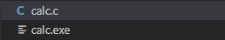
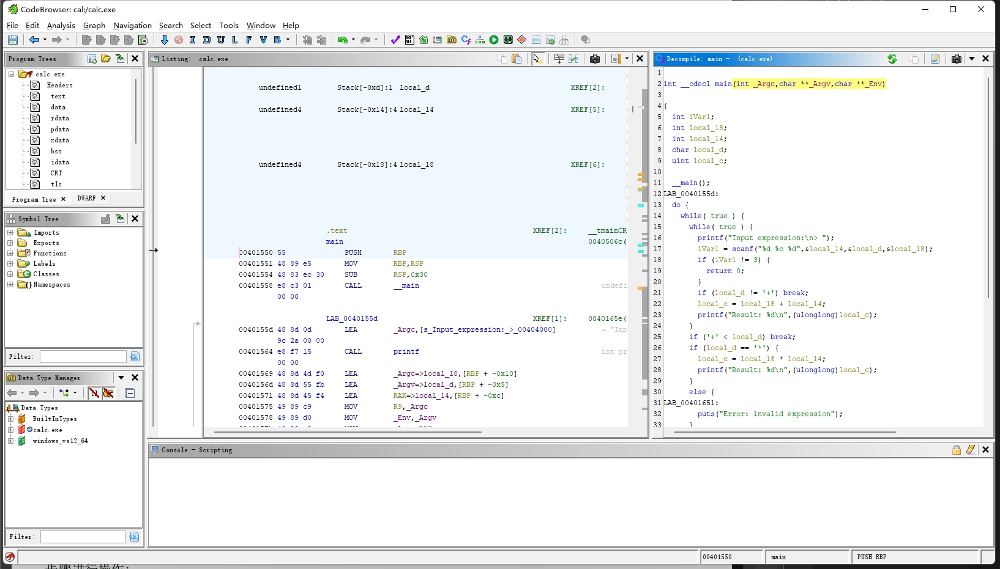

# 网络空间安全导论实验课  
## 实验二 软件安全：逆向工程、漏洞挖掘与利用  
刘镇豪 2022K8009929027 2023.10.17ver
___
### 准备部分
在使用Linux系统安装Ghidra时遇到了困难。
1. 在下载Ghidra源码时，由于其源码地址需要到GitHub上下载，但VPN代理无法在虚拟机中成功，进行一系列尝试后仍无效，故放弃。改用共享文件夹方式将Ghidra源码传递到虚拟机中。
2. 在配置Ghidra环境、安装需要的软件时，发现最新版本的Ghidra要求软件gradle的版本在7.3以上，但是Ubuntu的默认软件下载源中gradle版本为7.2，不符合要求，使用命令
    >sudo apt-get upgrade gradle

    仍没有作用。之后尝试手动下载新版本的安装包手动替换。实行后检查gradle版本直接报错，又进行一番尝试后无法解决，故放弃。
3. 最后选择在主机windows系统下配置环境并安装Ghidra
___
### 实验部分

#### 基础操作：
1. **编译：**

    > 深入理解编译过程是逆向工程的基础。在这一部分中，请使用实验中提供的（`calc .c`）程序或者自行寻找的程序，进行编译，将源代码转换为可执行程序。编译的过程是通过编译器将源代码转换为机器码的过程。在编译过程中，源码的语义应该与编译产物的语义保持一致。你需要使用反编译器查看编译后的汇编代码和伪C代码,并将源码中的不同部分对应到汇编和伪C的对应部分。
    > 在实验报告中，挑选两处，详细说明为什么源码和二进制程序对应位置语义一致。

先用vscode将源文件编译为可执行文件

将编译后得到的exe文件置入Ghidra中运行得到汇编代码与伪代码，将源代码与伪C代码进行比较

先将变量对应。首先不难发现，源代码中在开头只定义了4个变量，而伪C代码中定义了五个变量。我最开始怀疑的是 ***local_c*** 这个变量是多出来的变量，因为它的定义类型是无符号整型。但是当我分析这个变量与其他变量之间的关系后，我发现 ***local_c*** 是源代码中的 ***result*** 变量。同时，发现 ***local_14*** , ***local_18*** 分别对应源代码中变量 ***operand1*** , ***operand2***  又能根据字符类型定义推断出 ***local_d*** 对应源代码中变量 ***operator*** 进而知道变量 ***iVarl*** 才是在伪C代码中增多的变量。再回到伪C代码中寻找，发现其将 ***scanf*** 的返回值寄存在了 ***iVarl*** 变量中。
接着观察函数部分，伪C代码通过将源代码中的 ***switch*** 函数拆解成为，基于运算符号ASCII码的比较的几部分 ***if-else*** 判断语句。伪C代码中大部分语句与C源码差别不大很好理解。有趣的部分是伪C代码中除法运算结束后出现的 ***goto LAB_0040155d*** 语句。
经过查找，我了解到 ***LAB*** 是标签的意思。由于伪C代码不是使用 ***switch***语句来判断运算符号，而是使用 ***if-else***语句来依次判断运算符号。若没有 ***goto LAB_0040155d*** 语句，那么在伪C代码判断运算符号是否为除号后，无论是否计算完成，都会再次计算两数相减，并输出两数相减的结果。而 ***goto LAB_0040155d*** 语句，可以让程序在判断运算为除法且运算完毕后，直接返回程序开头，进行下一次的输入，不会在进行减法运算。

代码中另一个 ***LAB_00401651*** 标签也是相似的作用。

为了说明源码与汇编代码中的语义一致。我选择了一处定义变量处的代码，还有一处运算过程中的代码。
在源码开头部分定义变量部分。
~~~
int main() {
    char operator;
    int operand1, operand2, result;
~~~
~~~
int __cdecl main(int _Argc, char * * _Argv, char * * _Env)
int               EAX:4          <RETURN>
int               ECX:4          _Argc
char * *          RDX:8          _Argv
char * *          R8:8           _Env
undefined4        Stack[-0xc]:4  local_c                                 
undefined1        Stack[-0xd]:1  local_d                                
undefined4        Stack[-0x14]:4 local_14        
undefined4        Stack[`0x18]:4 local_18             
~~~ 
汇编代码中 ***int __cdecl main(int _Argc, char * * _Argv, char * * _Env)*** 对应源码中的 ***int main()*** 。

汇编代码中main函数的三个输入参量分别为

接下来， ***int               EAX:4          RETURN*** 语句表示将main函数返回值储存在寄存器 ***EAX*** 中，大小为4个字节。
后三行代码定义与其类似。
***undefined4        Stack[-0xc]:4  local_c*** 表示定义一个未初始化的变量，即可以用任何类型的数据填充，大小为4字节。其被存放在用户栈中，相对于堆栈指针（***Stack***）的偏移量。偏移量为负数表示该变量在堆栈指针的上方， -0xc 代表12个字节的偏移。变量名为 ***local_c***  。这个语句中 ***undefined4***中的4，与 ***Stack[-0xc]:4***中的4相对应，都表示占用4个字节。但前者声明的是变量的大小，后者决定了其在栈中所占用的空间。汇编代码中后三行也是一样的道理。